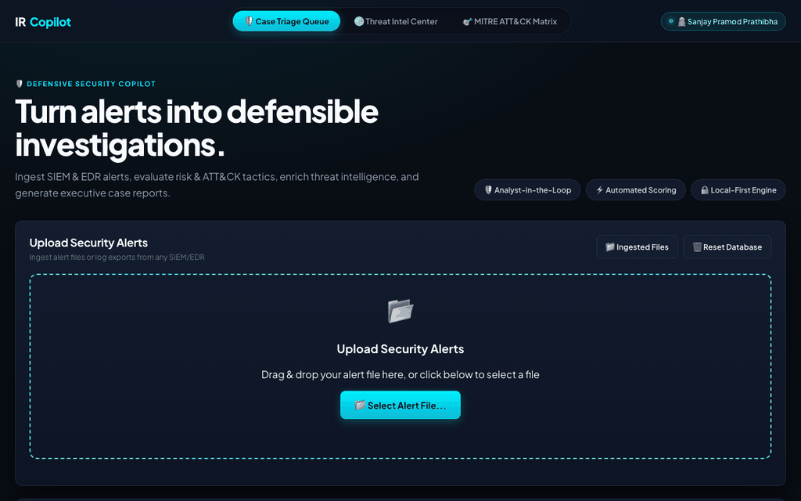
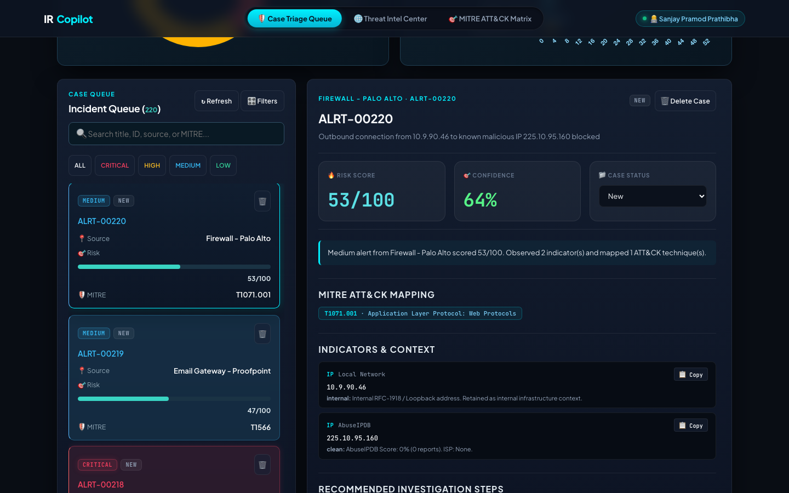
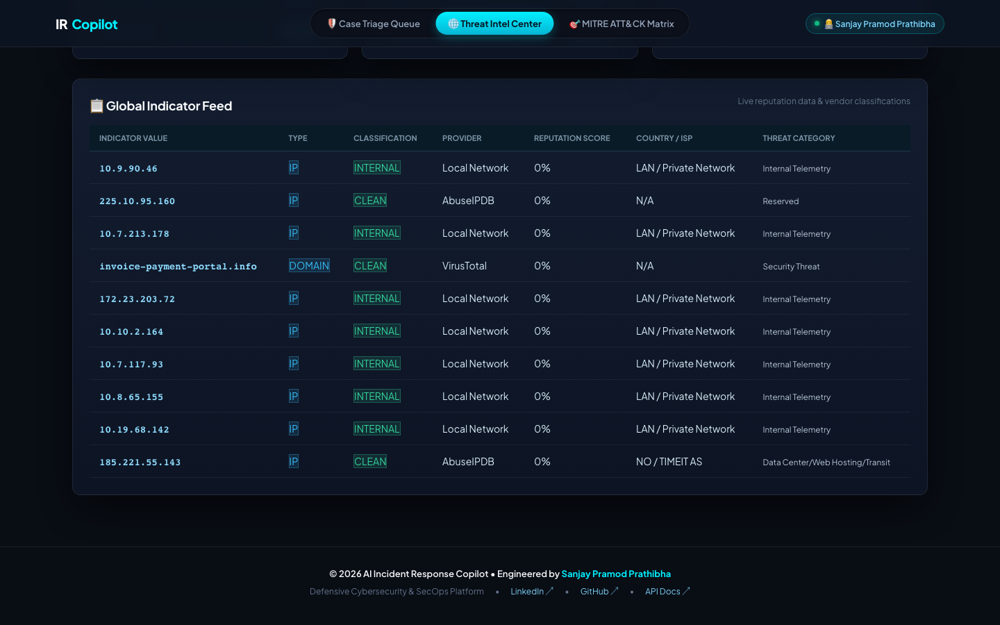
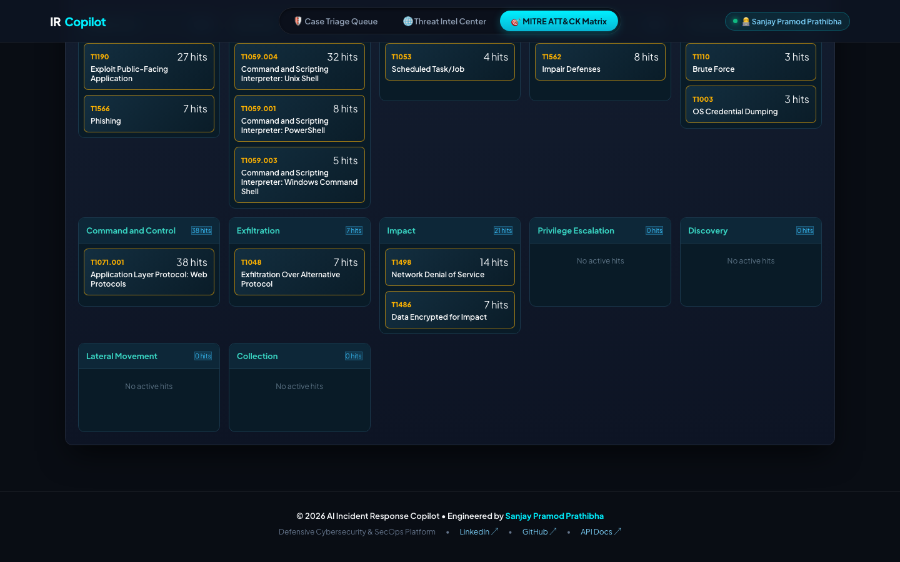
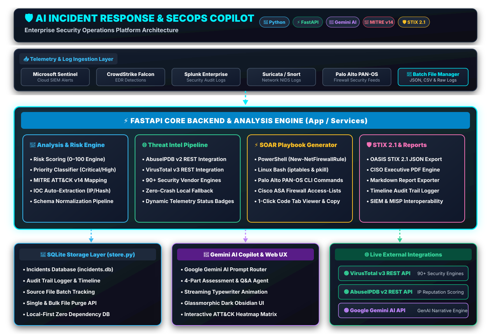

# 🛡️ AI Incident Response & SecOps Copilot

[](https://ai-incident-response-copilot.onrender.com)
[](https://www.python.org/)
[](https://fastapi.tiangolo.com/)
[](https://oasis-open.github.io/cti-documentation/)
[](https://attack.mitre.org/)
[](LICENSE)

> 🌐 **Permanent 24/7 Live Web Demo:** [https://ai-incident-response-copilot.onrender.com](https://ai-incident-response-copilot.onrender.com)



An enterprise-grade, local-first **Defensive Cybersecurity & Security Operations (SecOps) Platform** powered by **FastAPI** and **Gemini AI Copilot**. Designed for SOC Analysts, Incident Responders, and Security Engineers to automate alert triage, evaluate risk scores, map behaviors against MITRE ATT&CK Enterprise Matrix v14, generate executable SOAR containment playbooks, enrich threat intelligence via AbuseIPDB and VirusTotal, and export OASIS STIX 2.1 threat exchange bundles.

---

## 👨‍💻 Developer & Author Profile

* **Developer:** **Sanjay Pramod Prathibha**
* **LinkedIn:** [linkedin.com/in/sanjay-p-p](https://www.linkedin.com/in/sanjay-p-p/)
---

## 📸 Platform Screenshots

### 🛡️ Case Triage Queue & AI Analyst Workbench


### 🌐 Threat Intelligence Center & CTI API Status


### 🎯 MITRE ATT&CK Enterprise Matrix v14 Heatmap


---

## 🏗️ System Architecture Diagram



---

## 🌟 Key Features & Architecture

### 1. 📥 Multi-Format Alert Ingestion & Batch Management
* Ingest security alerts in bulk or individually from **Microsoft Sentinel, CrowdStrike Falcon, Splunk, Palo Alto PAN-OS, Snort/Suricata, and AWS GuardDuty**.
* Supports **JSON, JSONL, CSV, and raw log exports** with auto-schema normalization.
* **📁 Ingested Files Batch Manager:** Interactively view, filter by source file, or bulk-delete specific alert batches from SQLite storage in one click.

### 2. 🎯 Risk Scoring & MITRE ATT&CK Enterprise Matrix v14
* **Automated Risk Engine:** Calculates 0–100 risk scores, confidence levels %, and priority levels (`CRITICAL`, `HIGH`, `MEDIUM`, `LOW`).
* **Tactical Mapping:** Rules across *Execution*, *Persistence*, *Privilege Escalation*, *Defense Evasion*, *Credential Access*, *Discovery*, *Lateral Movement*, *Collection*, *Command & Control*, *Exfiltration*, and *Impact*.
* **Interactive Heatmap Grid:** Full-screen MITRE ATT&CK Enterprise Matrix visualizer with incident hit counters.

### 3. ⚡ SOAR Executable Containment Playbook Generator
Generates production-ready, syntax-highlighted, executable remediation scripts based on extracted incident telemetry:
* **Windows PowerShell:** Automated Windows Firewall `New-NetFirewallRule` blocking, `Disable-ADAccount` user lockdown, `Stop-Process` execution kill, and DNS cache flush.
* **Linux Bash:** Real `iptables -A INPUT -s <IP> -j DROP` ingress/egress quarantine, `pkill -9 -u <user>` session termination, and network interface isolation.
* **Enterprise Firewall CLI:** Palo Alto PAN-OS `set address-group` commit commands & Cisco ASA `access-list` definitions.

### 4. 🌐 Real-Time Threat Intelligence Enrichment
* **Live API Integrations:** Real-time reputation scoring for IPs, domain names, and SHA-256 file hashes via **AbuseIPDB v2 API** and **VirusTotal v3 API** (90+ security engines).
* **Graceful Fallback:** Operates seamlessly in offline/local-rule mode if API keys are absent.
* **Live Status Telemetry:** UI badges report active API connectivity status (`🟢 Live API Connected (.env)`).

### 5. 🛡️ OASIS STIX 2.1 Standardized Threat Exchange Export
* Exports official STIX 2.1 JSON Threat Exchange Bundles (`application/stix+json`) compliant with the OASIS specification.
* Includes SDOs (`identity`, `report`, `indicator`, `attack-pattern`) and SRO relationships (`indicates`) for interoperability with SIEMs, MISP, and threat intelligence platforms.

### 6. 🤖 Gemini AI Copilot & Analyst Workbench
* **Prompt Routing Engine:** Interactive natural language Q&A and 4-part structured assessment report generator (`📋 Full Assessment`).
* **Sleek UX Delivery:** Streaming typewriter delivery animation, glowing radar scanline pulse, per-message inline copy buttons, and continuous auto-scrolling caret.

---

## ⚡ Quick Start

### Prerequisites
* Python 3.9 or newer
* Git

### Installation & Execution

```bash
# 1. Clone the repository
git clone https://github.com/sanjaypramodprathibha/ai-incident-response-copilot.git
cd ai-incident-response-copilot

# 2. Create and activate a Python virtual environment
python3 -m venv .venv
source .venv/bin/activate  # On Windows: .venv\Scripts\Activate.ps1

# 3. Install dependencies
pip install -r requirements.txt

# 4. (Optional) Set API keys in .env
cp .env.example .env

# 5. Launch the FastAPI server
python -m uvicorn app.main:app --host 127.0.0.1 --port 8000 --reload
```

Open your browser to **[http://127.0.0.1:8000](http://127.0.0.1:8000)**.  
Interactive Swagger OpenAPI documentation is available at **[http://127.0.0.1:8000/docs](http://127.0.0.1:8000/docs)**.

---

## 🔑 Environment Variables (`.env`)

```ini
# Optional: Google Gemini AI Copilot
GEMINI_API_KEY=your_gemini_api_key_here
GEMINI_MODEL=gemini-flash-latest

# Optional: Threat Intelligence APIs
ABUSEIPDB_API_KEY=your_abuseipdb_key_here
VIRUSTOTAL_API_KEY=your_virustotal_key_here

# Optional: SQLite Database Location
DATA_DIR=./app/data
```

---

## 🛠️ API Surface

| Method | Endpoint | Description |
| :--- | :--- | :--- |
| `GET` | `/api/health` | Service health status check |
| `POST` | `/api/alerts` | Analyze and store a single security alert |
| `POST` | `/api/alerts/bulk` | Ingest and triages an array of alert JSON objects |
| `GET` | `/api/incidents` | List all triaged cases from SQLite storage |
| `GET` | `/api/incidents/{id}` | Retrieve full telemetry & assessment for an incident |
| `DELETE` | `/api/incidents/{id}` | Remove a single incident from storage |
| `GET` | `/api/incidents/sources/list` | List ingested files and batch alert counts |
| `DELETE` | `/api/incidents/sources/delete` | Bulk delete all alerts originating from a specific file |
| `GET` | `/api/incidents/{id}/soar-playbook` | Generate executable PowerShell, Bash & Firewall CLI scripts |
| `GET` | `/api/incidents/{id}/stix` | Download OASIS STIX 2.1 JSON Threat Exchange bundle |
| `GET` | `/api/incidents/{id}/report?format=pdf\|markdown` | Export formatted executive case report |
| `POST` | `/api/incidents/{id}/copilot` | Stream Gemini AI Copilot investigation narratives |
| `GET` | `/api/threat-intel/config` | Query active external CTI API key status |
| `GET` | `/api/threat-intel/search?query=...` | Live IOC reputation search across AbuseIPDB & VT |

---

## 🧪 Testing

Run the automated PyTest unit test suite:

```bash
PYTHONPATH=. pytest
```

---

## 📄 License

Distributed under the **MIT License**. Created by **Sanjay Pramod Prathibha**.
